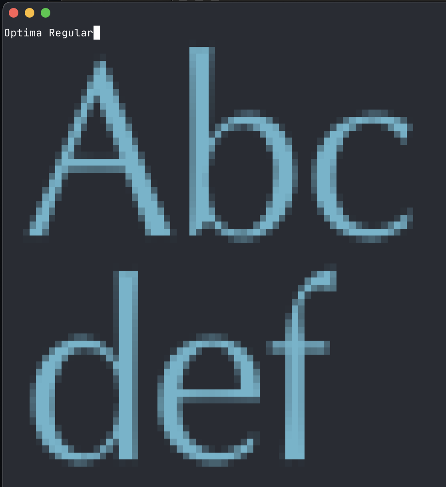

# tfonts

Demonstrates large true type font rending in the terminal with multiple options (from truecolor to mono).
`tfonts` will show a given text in all the fonts it finds in the system or indicated `-fontdir`.
Or use a specific `-font`. Use the left arrow key or backspace to navigate back, q,Q or Ctrl-C to exit.

Heavy lifting is using [ansipixels](https://github.com/fortio/terminal#fortioorgterminalansipixels) image to terminal rendering.

## Install

```sh
go install github.com/ldemailly/go-scratch/tfonts@latest
```

## Example

```
tfonts -autoplay 0.3s Abc def
```




## Options

```
tfonts help
```

```
tfonts v1.0.0 usage:
        tfonts [flags] 2 lines of words to use or default text
or 1 of the special arguments
        tfonts {help|envhelp|version|buildinfo}
flags:
  -all
         Show all font variants (default is only the first found per file)
  -autoplay duration
         If > 0, automatically advance to next font after this duration (e.g. 2s, 500ms)
  -color string
         Single text color, if empty use random colors
  -font path
         Font path to use instead of showing all the fonts in fontdir
  -fontdir path
         Directory path containing font files (default "/System/Library/Fonts")
  -gray
         Use grayscale
  -mono
         Use monochrome (1-bit) color
  -rune rune
         Rune to check for in fonts (default: first rune of first line)
  -seed int
         set fixed seed, 0 is random one
  -size points
         Font size in points (default 36)
  -truecolor
         Use true color (24-bit) instead of 256 colors (default true)
```
